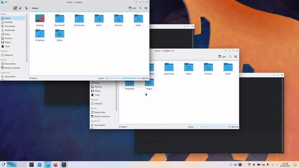

# Application Switcher

[latest release](https://github.com/nclarius/application-switcher/releases/latest) | [view in KDE store](https://www.pling.com/p/1805105/)

Extension for KDE's window manager to automatically raise all other windows of the same application together when activating one of them.

This creates a workflow with two levels of task switching: one mode for switching applications and one mode for switching between windows of an application. 

Raising all windows of an application whenever an application is being switched to means that closing or minimizing a window will keep focus on the same application by switching to the most recently active window of that application provided that there is any, rather than switching to the most recently active window which may belong to a different application.



## Installation

### Dependencies

`kwin`.

### Installation via graphical interface

**Please make sure to select the most recent version (v1.0)** in the installation process.

A [bug](https://bugs.kde.org/show_bug.cgi?id=453521) in Discover causes a wrong version to be installed, so using the installation module in System Settings instead is recommended.

1. Install the script via Discover or *System Settings* > *Window Management* > *KWin Scripts* > *Get New Scripts …* > search for *Application Switcher* > *Install*.
2. Enable the script by activating its checkbox, and apply the settings.

### Installation via command line

```bash
git clone https://github.com/nclarius/kwin-application-switcher.git
cd kwin-application-switcher
./install.sh
```

## Usage

### Tips

If you are intending to have one mode for switching applications and one mode for switching application windows, you may want to use the following settings:
- Task switcher: 

  System Settings > Window Management > Task Switcher >

  - Main (for switching between applications) >
    - Visualization: Large Icons
    - Only one window per application: checked
    - Shortcuts > All windows (which now means switching applications): set your preferred shortcut pair, e.g. Alt+(Shift+)Tab; Current application: leave empty

  - Alternative (for switching between windows of an application) >
    - Visualization: Thumbnails
    - Only one window per application: unchecked
    - Shortcuts > Current application: set your preferred shortcut pair, e.g. Alt+(Shift+)`; All windows: leave empty

- Task bar: 

  right-click on task bar > Configure Task Manager … > Behavior > Group: By application name; Combine into single button: checked

### Limitations

- The KWin scripting API provides no possibility to distinguish how a window was activated (via alt-tabbing, panel task bar clicking, clicking on the window, or being requested from another process), so the plugin can not be applied selectively to only some activation types.
- The KWin scripting API provides no possibility to manipulate the recently used and stacking order without actually activating the window, so focus will briefly shift as windows are being brought to the front; however this happens so fast it shouldn’t be noticeable.

## Small Print

© 2022 Natalie Clarius \<natalie_clarius@yahoo.de\>

This work is licensed under the GNU General Public License v3.0.  
This program comes with absolutely no warranty.  
This is free software, and you are welcome to redistribute and/or modify it under certain conditions.  

Development was sponsored by user RedBearAK.

If you would like to thank me, you can always make me happy with a review or a cup of coffee:  
<a href="https://store.kde.org/p/1619690"></a> <a href="https://www.paypal.com/donate/?hosted_button_id=7LUUJD83BWRM4"></a>&nbsp;&nbsp;<a href="https://www.buymeacoffee.com/nclarius"></a>
